# Offline Note Taker Architecture

Offline Note Taker is a local-first Windows AI app for Snapdragon X devices. The app proves that meeting audio can stay on-device while still producing useful transcripts, notes, action items, and Q&A.

```mermaid
flowchart LR
    A["Microphone or audio file"] --> B["Audio metadata and WAV recorder"]
    B --> C["Whisper Windows / Whisper-Base"]
    C --> D["Timestamped transcript"]
    D --> E["Cleanup and chunking"]
    E --> F["Grounded extractor"]
    F --> G["Qwen3-4B via Genie / QAIRT"]
    G --> H["Validated meeting notes"]
    H --> I["Q&A, exports, local session library"]
```

## Engineering Highlights

- Local runtime detection validates Whisper Windows, Whisper ONNX assets, QAIRT, Genie, Qwen3 bundle files, ADSP libraries, and Hexagon NPU visibility.
- Persistent setup stores paths under `%LOCALAPPDATA%\OfflineNoteTaker\settings.json`, so users do not need to keep exporting environment variables.
- Meeting sessions are local folders with audio, transcript JSON, notes JSON, diagnostics, and optional exports.
- Qwen output must parse as structured JSON and pass transcript-grounding checks before becoming final notes.
- Deterministic fallback notes keep the app useful when the local LLM times out, returns malformed JSON, or is cancelled.
- `offline-note-taker eval` runs golden transcript fixtures to measure action extraction, owner/deadline accuracy, citation coverage, and unsupported decisions.
- The app `Performance` tab produces a copyable local proof report after each run.
- No cloud calls or telemetry are required for normal recording, transcription, summarization, Q&A, or export.

## Why This Matters

The demo shows a privacy-preserving voice AI workflow on an AI PC: Whisper handles speech-to-text locally, Qwen handles meeting intelligence locally, and the app exposes enough diagnostics to prove what ran and where.
